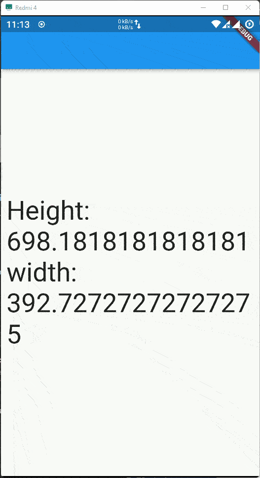

# noob

A new Flutter project.

# Preview
| [Future Builder](https://github.com/biplobsd/flutterNoob/tree/21abe0810d27452d3a6c4126e263d96729fcba64) | [Sliver](https://github.com/biplobsd/flutterNoob/tree/a09fb30933e713a8721be1ec0ba9d447ca28911e) | [ClipRRect](https://github.com/biplobsd/flutterNoob/tree/ef4edf29cabf95a55001d9c87cfe2e8c217c7d9e) |
| ----------- | ----------- | ----------- |
|  |  |  |
| [Spread Operator](https://github.com/biplobsd/flutterNoob/tree/384140f6277bc091607782a3b83fa676a22581d6) | [ListAddRemoveSearch](https://github.com/biplobsd/flutterNoob/tree/b686bfae35406149eba0c7b9bae2ae331dcc311b) | [Screen Size](https://github.com/biplobsd/flutterNoob/tree/114e273462028a54757fd6fa362edd508885e51b) |
|  |  |  |
| [Animated Icon Buttons](https://github.com/biplobsd/flutterNoob/tree/3414641feeb3e1b0ca48c25fc4d42f7f82f2e055) | [WordPairGenerator](https://github.com/biplobsd/flutterNoob/tree/6587c9addcadb5ebeec8bca3f3fde727de8ef333) |
|  |  |

## Getting Started

This project is a starting point for a Flutter application.

A few resources to get you started if this is your first Flutter project:

- [Lab: Write your first Flutter app](https://flutter.dev/docs/get-started/codelab)
- [Cookbook: Useful Flutter samples](https://flutter.dev/docs/cookbook)

For help getting started with Flutter, view our
[online documentation](https://flutter.dev/docs), which offers tutorials,
samples, guidance on mobile development, and a full API reference.

## Getting Started

This project is a starting point for a Flutter application.

A few resources to get you started if this is your first Flutter project:

- [Lab: Write your first Flutter app](https://flutter.dev/docs/get-started/codelab)
- [Cookbook: Useful Flutter samples](https://flutter.dev/docs/cookbook)

For help getting started with Flutter, view our
[online documentation](https://flutter.dev/docs), which offers tutorials,
samples, guidance on mobile development, and a full API reference.
